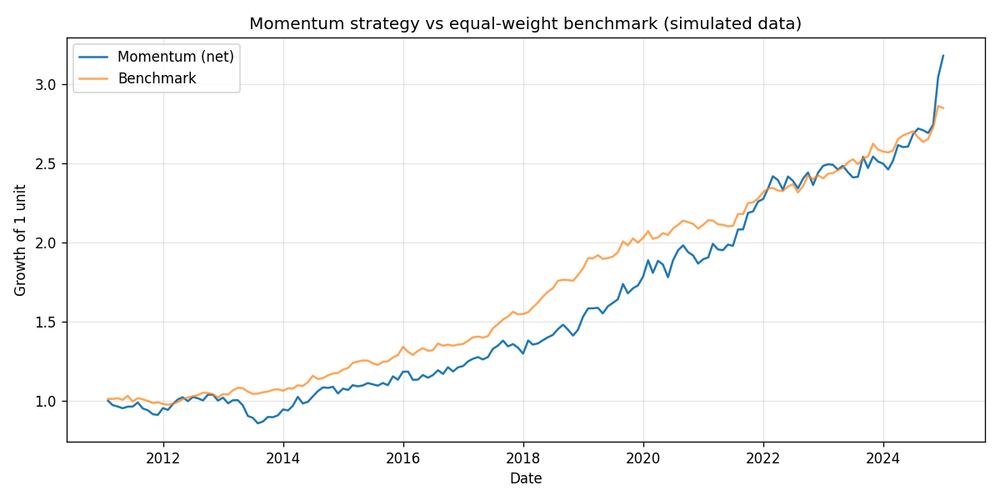
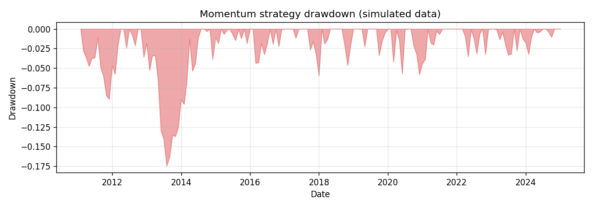

# Momentum Backtest

A cross-sectional momentum strategy, built from scratch in Python. Every month
the strategy ranks a universe of stocks by their recent trailing return, buys
an equal-weighted basket of the strongest names, holds for a month, and
repeats. There is an option to short the weakest names too.

The point of this repo is not to claim a money printer exists. It is to show
the full loop done honestly: a clearly defined signal, a backtest with no
lookahead bias, an explicit transaction cost, and performance numbers you can
actually trust because you can see exactly how they were produced.

## What the strategy is actually testing

Momentum is one of the most studied anomalies in finance. The plain version of
the claim is that, over horizons of a few months to a year, recent winners
keep winning and recent losers keep losing for a while longer. Jegadeesh and
Titman documented this for US stocks back in 1993, and it has shown up across
many markets and asset classes since.

This project tests the cross-sectional version of that idea on a small,
liquid US equity universe:

- Each month, score every stock by its return over the last twelve months,
  skipping the most recent month (the "12 minus 1" window).
- Skipping the latest month matters. At the one-month horizon, returns tend to
  reverse rather than continue, so leaving it out gives a cleaner momentum
  read.
- Sort the scores and hold the top slice (30% by default), equally weighted.
- Rebalance monthly.

That is the whole thesis. The backtest is just an honest measurement of how
that rule would have behaved.

## Example output

The charts below come straight from the plotting code in this repo. The
committed versions here were generated on simulated data, so they show what the
output looks like. Run `python scripts/run_backtest.py --save-plots` to
reproduce them on live market data.





## How it works

The code is split into small modules so each piece can be read and tested on
its own.

| Module        | Responsibility                                              |
|---------------|-------------------------------------------------------------|
| `data.py`     | Load adjusted close prices behind a vendor-agnostic loader, with local caching |
| `signals.py`  | Turn prices into the 12-1 momentum score                    |
| `backtest.py` | Build the monthly weights and compute returns net of costs  |
| `metrics.py`  | CAGR, volatility, Sharpe, Sortino, drawdown, and friends    |
| `plotting.py` | Equity curve and drawdown charts                            |

Two design choices are worth calling out:

**No lookahead.** The weights chosen at the end of a month are multiplied by
the *next* month's returns. A return never helps pick the position that earns
it. There is a unit test that pins this behaviour down.

**The data layer is swappable.** The strategy never imports a data vendor. It
asks a loader for a tidy frame of adjusted close prices and nothing more. The
default loader uses yfinance with parquet caching, so the first run downloads
and every run after is instant and works offline. Swapping in a paid feed like
Tiingo or Polygon means writing one new loader class, with no change to the
strategy code.

## Getting started

```bash
git clone https://github.com/KelsonLam/momentum-backtest.git
cd momentum-backtest
pip install -r requirements.txt
python scripts/run_backtest.py
```

The first run pulls prices from Yahoo Finance and caches them under
`data/cache/`. To see the charts as well:

```bash
python scripts/run_backtest.py --save-plots
```

You can override any of the main settings from the command line without
editing `config.yaml`:

```bash
# A shorter, more aggressive lookback, long-short, with higher assumed costs
python scripts/run_backtest.py --lookback 6 --long-short --cost-bps 20
```

Run `python scripts/run_backtest.py --help` for the full list.

## Reading the output

A run prints a block like this (numbers will depend on your universe, dates,
and settings, so treat the shape below as illustrative, not a result to quote):

```
Strategy performance (net of costs)
--------------------------------------
Total return           ...
CAGR                   ...
Annualized volatility  ...
Sharpe ratio           ...
Sortino ratio          ...
Max drawdown           ...
Calmar ratio           ...
Hit rate               ...
Months                 ...
Avg annual turnover    ...
```

The Sharpe ratio and max drawdown usually tell you more than the headline
return. A high return that comes with a brutal drawdown and a low Sharpe is not
a strategy you could actually sit through.

## Being honest about the costs and caveats

A backtest without honest analysis is just a chart that flatters whoever made
it. Here is what this one does and does not account for.

What it includes:

- **Transaction costs.** Every rebalance charges a cost proportional to how
  much of the book turns over. The default is 10 basis points per unit of
  turnover, which is charged on both the sell and buy legs, so a full rotation
  of the portfolio costs roughly twice that. Momentum trades a lot, so this
  number matters, and you can stress it with `--cost-bps`.
- **Adjusted prices.** Splits and dividends are baked into the price series, so
  returns are total returns rather than price-only.

What it leaves out, and why you should keep it in mind:

- **Survivorship bias.** The universe is a fixed list of companies that are
  large and liquid *today*. A truly fair test would use the membership of an
  index as it stood at each point in the past, including the names that later
  went bankrupt or got delisted. This repo does not do that, and that omission
  tends to flatter results.
- **Slippage and market impact.** The cost model is a flat per-trade haircut.
  It does not model the fact that trading more size moves the price against
  you.
- **Short-side realism.** When long-short is enabled, the test assumes you can
  borrow every short at no cost. In reality the hardest names to short are
  often the most expensive to borrow.
- **A single path of history.** One backtest is one realization of the past.
  It is not a confidence interval. Treat the numbers as a description of what
  happened, not a forecast of what will.

If you take one thing from this section: the strategy can look good or bad
depending on the universe, the dates, and the cost assumption, and an honest
write-up names those dependencies instead of hiding them.

## Benchmark-relative metrics

Absolute return is only half the question. `benchmark.py` adds the
active-management measures that say whether the strategy beat a simple benchmark,
and how reliably:

```python
from momentum_backtest import benchmark
benchmark.information_ratio(strategy_returns, benchmark_returns)
benchmark.tracking_error(strategy_returns, benchmark_returns)
benchmark.beta(strategy_returns, benchmark_returns)
```

A large absolute return that simply tracks the benchmark shows up as a low
information ratio, which is the honest read: it was beta, not skill.

## Tests

```bash
pip install pytest
pytest
```

The suite runs on synthetic price paths, so it is fast and needs no network. It
checks the signal definition, the no-lookahead alignment, dollar-neutrality of
the long-short book, that costs actually reduce returns, and the core metrics.

## Project layout

```
momentum-backtest/
├── config.yaml              # universe, dates, strategy and cost settings
├── requirements.txt
├── scripts/
│   └── run_backtest.py      # command line entry point
├── src/momentum_backtest/
│   ├── data.py
│   ├── signals.py
│   ├── backtest.py
│   ├── metrics.py
│   └── plotting.py
└── tests/
    └── test_backtest.py
```

## License

MIT. See [LICENSE](LICENSE).
